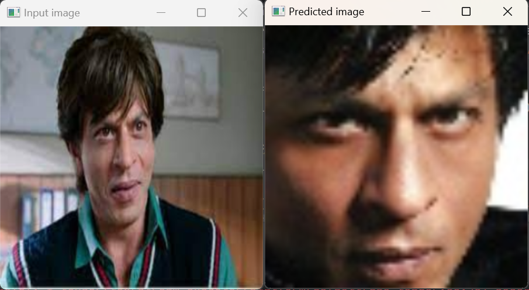

# image_identifier

This project leverages deep learning, utilizing TensorFlow, the KGGFACE model, and Streamlit to create a web application capable of identifying simliar face of actors or actresses based on a provided image. The model is trained on a specialized dataset of celebrity faces.

## Key Feature
- Deep Learning Model: Built using TensorFlow, the project employs the KGGFACE model, which is pre-trained for facial recognition tasks.
- Training & Testing: The model is fine-tuned on a dataset of actor and actress images to ensure accurate identification. After training, it is thoroughly tested to validate its performance.
- Web Application Interface: Streamlit is used to create an intuitive interface where users can upload images and view results instantly.


**Install Dependencies**
```
pip install
```





